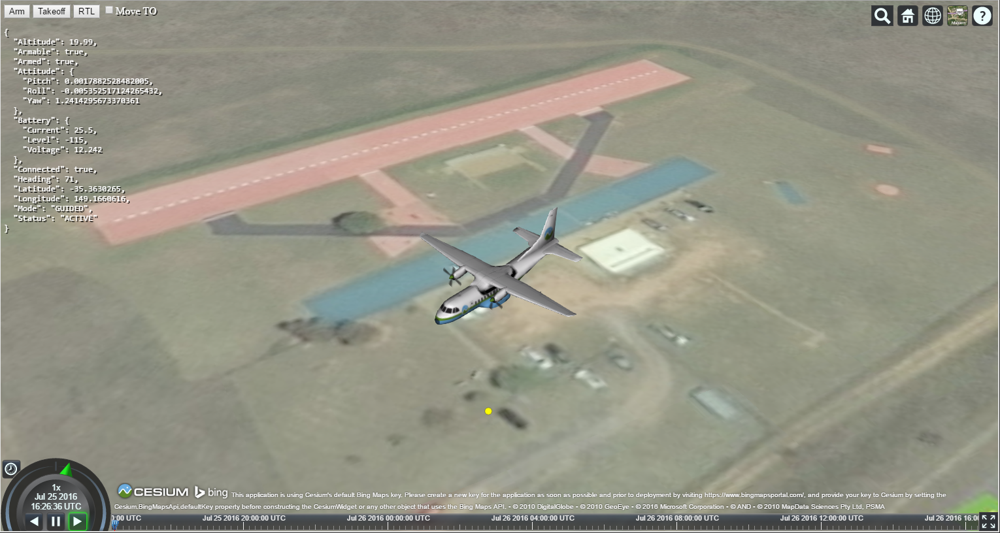

# Cesium Drone

A proof of concept web based GCS built on [DroneKit Python](https://github.com/dronekit/dronekit-python) and [Cesium](https://cesiumjs.org)

Inspired by [Tower Web](https://github.com/dronekit/tower-web)



## Running

```
git clone https://github.com/tthompson/cesiumdrone.git
pip install -r requirements.txt
cd cesiumdrone
python main.py
```

Then open <http://localhost:8008/> in a browser.

The connection string for the drone is at the top of main.py. It is currently setup to run with the defaults for the
simulator as described in the [DroneKit documentation](http://python.dronekit.io/develop/sitl_setup.html).

## License

MIT/Apache-2.0
